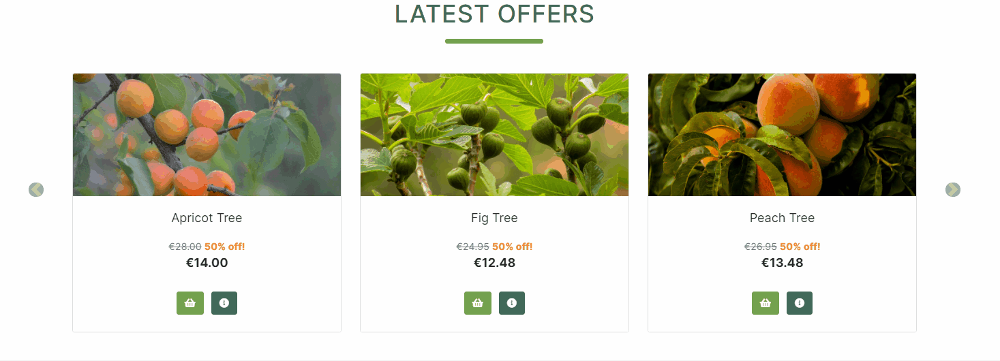
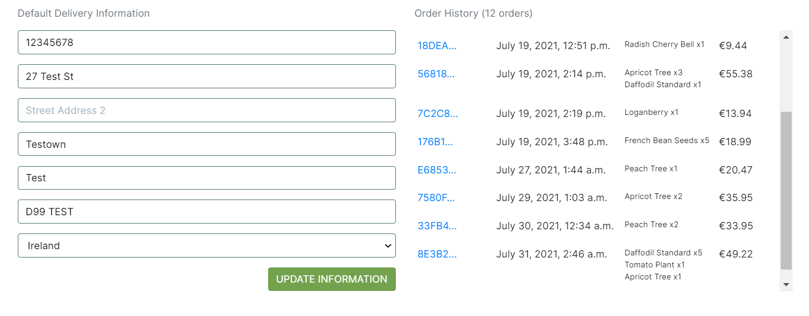
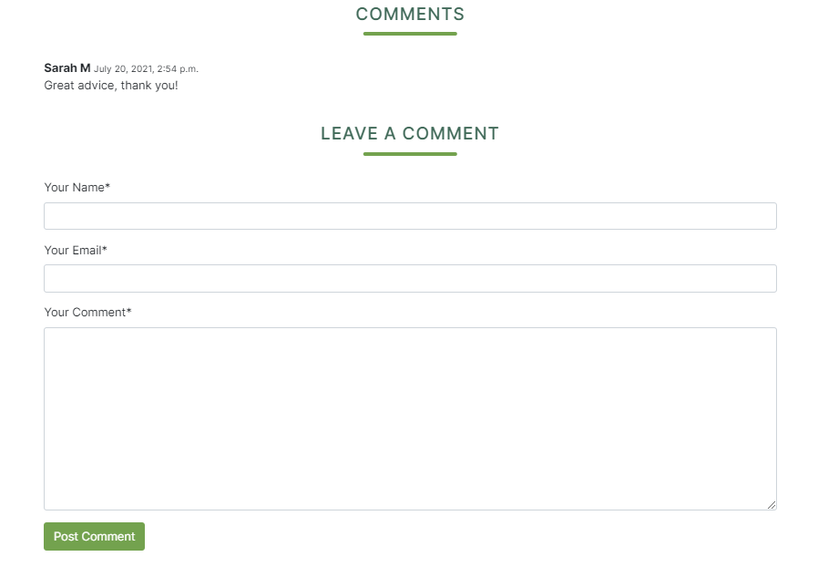

<div align="center">
    <a href="https://pickles-eshop.herokuapp.com/" target="_blank"></a>
</div>


<h3><a href="https://pickles-eshop.herokuapp.com/" target="_blank">Click here</a> to view the site on Heroku.</h3>

Credit card transaction details:

Card No: 4242 4242 4242 4242

Expiry: 04 / 24

CVC: 424

ZIP: 42424

## Table of Contents

1. [**User Experience**](#user-experience)
    - [**Goals**](#goals)
        - [**Visitor Goals**](#visitor-goals)
        - [**Business Goals**](#business-goals)
    - [**User Stories**](#user-stories)
    - [**Wireframes**](#wireframes)
    - [**Design**](#design)
2. [**Features**](#features)
    - [**Existing Features**](#existing-features)
    - [**Future Features**](#future-features)
3. [**Information Architecture**](#information-architecture)  
4. [**Technologies Used**](#technologies-used)  
5. [**Testing**](#testing)
6. [**Deployment**](#deployment)
    - [**Local Deployment**](#local-deployment)
    - [**Heroku Deployment**](#heroku-deployment)
7. [**Credits**](#credits)
8. [**Acknowledgements**](#acknowledgements)

## User Experience

- ### Goals

  #### Visitor Goals

  - Be able to find the products I need in a fast and efficient manner.
  - Be able to make a safe and secure purchase.
  - Reduce my carbon footprint by growing my own produce.
  - Improve my health by increasing my fruit and veg intake.
  - Buy from a trustworthy online shop.

  #### Business Goals

  - Provide an attractive and fully functional website to increase brand reputation.
  - Provide a website with a great user experience on desktop, tablet and mobile devices.
  - Add regular blog posts to help drive traffic to the website and increase SEO.
  - Add useful blog content to build trust with existing and potential customers.

- ### User Stories

    As a **store owner**, I want to be able to:

    1. Add a product, so that I can add new items to my store.
    2. Edit a product, so that I can change the details of the product such as its price, description, image and other properties. 
    3. Delete a product, so that I can remove items from my store that are no longer available.
    4. Add a blog post, so that I can add new content to my blog page to help drive traffic to my store.
    5. Edit a blog post, so that I can change the details of the blog such as its title, content, image and other properties. 
    6. Delete a blog post, so that I can remove blog posts that are outdated or irrelevant.
    7. Delete a blog post comment, so that I can remove a comment that contains offensive content.
    8. Delete a product review, so that I can remove a review that contains offensive content.

    As a **visitor**, I want to be able to:

    1. Easily register for an account so that I can login and view my account.
    2. View all the available products so I can choose some to purchase.
    3. Sort all of the available products based on their price, name or category.
    4. View a particular category of products so I can find products I am interested in faster.
    5. Sort a particular category of products based on their price, name or category.
    6. Sort multiple categories of products simultaneously to find the best-priced products across broad categories such as plants or seeds.
    7. View the details of an individual product such as its price, description and reviews.
    8. Leave a review of a product so I can let other shoppers know what I think of the product.
    9. Search for a product by name or description so that I can quickly find a specific product.
    10. Quickly see search results and the number of results.
    11. Quickly add a product to my basket without having to view that product's individual page.
    12. Easily select the quantity of a product when purchasing it.
    13. View the products in my shopping basket to be purchased.
    14. Adjust the quantity of individual items in my shopping basket.
    15. Easily view the total value of my purchases at any time.
    16. Quickly enter my personal and payment information so that I can check out fast and hassle-free.
    17. View an order confirmation and receive an email confirmation after completing a purchase.
    18. Leave a comment on a blog post so I can contribute to a subject I am interested in.

    As a **registered user**, I want to be able to:

    1. Easily login or logout of my account.
    2. Easily recover my password if I forget it.
    3. Have a personalized user profile page so that I can view my order history and delivery information.
    4. Easily add or update my delivery information.

- ### Wireframes

  The wireframes for this project were created using Balsamiq.

  - [Home Page](https://github.com/Johnny-Morgan/pickles/blob/master/docs/wireframes/home_page_wireframes.pdf)

  - [Products Page](https://github.com/Johnny-Morgan/pickles/blob/master/docs/wireframes/products_page_wireframes.pdf)

  - [Product Info Page](https://github.com/Johnny-Morgan/pickles/blob/master/docs/wireframes/products_info_page_wireframes.pdf)

  - [Basket Page](https://github.com/Johnny-Morgan/pickles/blob/master/docs/wireframes/basket_page_wireframes.pdf)

  - [Checkout Page](https://github.com/Johnny-Morgan/pickles/blob/master/docs/wireframes/checkout_page_wireframes.pdf)

  - [Blog Page](https://github.com/Johnny-Morgan/pickles/blob/master/docs/wireframes/blog_page_wireframes.pdf)

  - [Blog Post Page](https://github.com/Johnny-Morgan/pickles/blob/master/docs/wireframes/blog_post_page_wireframes.pdf)

- ### Design

  - #### Colour Scheme
    
    

    - Hookers Green #416A59
    - Asparagus #73A24E
    - Cadmium Orange #FB8B2E
    - Cornsilk #FFF7D3

    Two shades of green were chosen as the main colours of this website. Green was chosen because it is associated with nature, freshness and health. 
    
  - #### Typography

    [Inter](https://fonts.google.com/specimen/Inter) was chosen as the main font for this website with sans-serif as the fallback font.


## Features

### Existing Features

- ### Sitewide features

  - Responsive Bootstrap Navigation bar.

    The navigation contains links to view all of the products as well as links to product categories. The account link contains a dropdown menu that changes depending on the user. A non logged in user will be given the option to register or login. A logged-in shopper will see a link to a profile page and a logout link. A logged-in superuser will see a link to a product admin page. 
    
    On mobile and tablet devices, the product links are contained in a hamburger drop-down menu and the search bar is contained in a dropdown. Entering a search term will redirect the user to the products page with a list of products that match the search term. 

    A shopping basket is provided that shows the total value of the current basket contents. Clicking the basket icon redirects the user to the shopping basket page.

    

  - A footer with social media links.

    

  - Toast messages are featured across the site and are displayed when a user performs certain actions such as adding a product to their shopping basket or commenting on a blog post. Messages appear for superusers when they perform CRUD operations such as adding or editing products.

    
    
  - Custom Error 404 page for if a user tries to open a page that does not exist as well as custom 403 error and custom 500 error pages. 

    

- ### Home Page

  The home page features the latest offers which are products that are on sale. On desktop and tablet devices, the products are displayed in a carousel. On mobile devices, the carousel is not displayed and the products are stacked on top of each other. Clicking on the image of a product or the information button will redirect the user to that product's information page. Clicking on the basket button will add that product to the user's shopping basket.

    

  There is an about section below the latest offers, with information about the company and contact details.

    

- ### Products Page

  The products page features all the products available on the site. The products can be sorted by their name, price and category. Clicking on the image of a product or the information button will redirect the user to that product's information page. Clicking on the 'ADD TO BASKET' button will add one item of that product to the user's shopping basket.

- ### Product Information Page

  Each product has its own information page that shows all the item's information such as its name, price, category and description. If the product has been reviewed, a star rating will be visible with a value that is the average of the ratings the product has received. Shoppers can choose a quantity and add the product to their basket. An accordion displays information on delivery costs and returns. Edit and delete buttons are visible for superusers.

    

  Below the product information, there is a review section that displays the reviewer's name, the date of the review, the star rating and the review text. A button to leave a review is provided that when clicked, opens up a form for a user to leave a review. A delete button is visible to superusers under every review.

    

- ### Basket Page

  The basket page displays all the products currently in the shopping basket. Shoppers can update the quantities or delete items from their basket. A summary shows the current basket total, the current delivery cost and the grand total. If applicable, a message is displayed that tells the shopper how much they need to spend to get free delivery. A button that redirects to the products page and a button that redirects to the checkout page is provided.

    

    If there are no products in the basket a message saying 'Your shopping basket is empty.' is displayed and a button that redirects to the products page.

    

- ### Checkout Page

  The checkout page features an order form that shoppers must fill out to complete the checkout process. Two links are visible below the delivery details encouraging guest shoppers to create an account or login to save their details.

    

  For logged-in shoppers, a checkbox is provided for them to save their delivery details to their profile.

    

  Payments are handled by Stripe including error messages and an email sent once the checkout process is completed. Currently, the site uses Stripe's test functionality rather than actual live payments. 

    

  A summary of the shopping basket is shown to the right of the order form on desktop, and above the form on tablet and mobile devices. 

    

- ### Checkout Success Page

  The checkout success page provides a summary of the order including the order number, order date, the products ordered as well as the delivery information and the billing information. A button is provided to direct users back to the products page.
    
    

- ### Profile Page

  The profile page contains a form prepopulated with the user's default delivery details. Users can use this form to update their information. Order history is also provided which lists all of the user's orders. Clicking on the order number directs the user to the order history page showing the order details.

    

- ### Product Admin Page

  The product admin page is only available to superusers. It contains a form for adding a new product to the database.

- ### Blog Page

  The blog page contains a preview of each blog post which includes the post image, the author, the date of the post and a preview of the post content. This page uses pagination, with three blog posts per page. Clicking on the read more link redirects to the blog post page. A button is visible to superusers allowing them to add a new blog post.

    

- ### Blog Post Page

  The blog post page contains the post image, tags, author, date and the content of the post. A button is provided to redirect users back to the blog page. Edit and delete buttons are provided for superusers.

    

  A list of comments is displayed below the blog post and a form is provided for users to add a comment. For superusers, a delete button is visible under every comment. 

    

- ### Other pages

  The django-allauth library is used to handle the user registration and authentication on this website. The allauth templates are used to provide the registration, login and forgot password pages as well as other pages such as resetting a password. The templates have been customised to match the site visual design.

    

### Future Features

  - Products can be sorted by rating.

  - Users can edit or delete their product reviews.

  - Users can edit or delete their blog post comments.

  - A blog search bar.

  - A feature to sort blog posts based on their tags.

  - Allow customers to pay with PayPal.

  - Allow customers to add a coupon or discount code at checkout.

  - A contact form to contact the business.

  - The ability to sign up for a newsletter or for email updates.

  - Remove the navigation and footer on the checkout page to prevent users from going to other pages and, thus breaking the checkout process.

  - Add customers name and email to their profile page.

## Information Architecture

SQLite was used in the development of this project as it is the default database used with Django. On deployment with Heroku, a Postgres database is used.

### Data Models

**Profiles App**

`User` model

Django's default [User](https://docs.djangoproject.com/en/3.2/ref/contrib/auth/) model is utilized for this project. 

`UserProfile` model 

| **Name**   | **Database Key**   | **Field Type**   | **Type Validation**   |
| ---------- | ------------------ | ---------------- | --------------------- |
| User | user | OneToOneField 'User' | on_delete=models.CASCADE |
| Default Mobile Number | default_mobile_number | CharField | max_length=20, null=True, blank=True |
| Default Street Address 1 | default_street_address_1 | CharField | max_length=80, null=True, blank=True |
| Default Street Address 2 | default_street_address_2 | CharField | max_length=80, null=True, blank=True |
| Default Town or City | default_town_or_city | CharField | max_length=40, null=True, blank=True |
| Default County | default_county | CharField | max_length=40, null=True, blank=True |
| Default Postcode | default_postcode | CharField | max_length=20, null=True, blank=True |
| Default Country | default_country | CountryField | blank_label='Country', null=True, blank=True |

**Products App**

`Category` model

| **Name**   | **Database Key**   | **Field Type**   | **Type Validation**   |
| ---------- | ------------------ | ---------------- | --------------------- |
| Name | name | CharField | max_length=254 |
| Friendly Name | friendly_name | CharField | max_length=254, null=True, blank=True |

`Product` model

| **Name**   | **Database Key**   | **Field Type**   | **Type Validation**   |
| ---------- | ------------------ | ---------------- | --------------------- |
| Category | category | ForeignKey 'Category' | null=True, blank=True, on_delete=models.SET_NULL |
| SKU | sku | CharField | max_length=254, null=True, blank=True |
| Name | name | CharField | max_length=254 |
| Description | description | TextField |
| Price | price | DecimalField | max_digits=6, decimal_places=2 |
| On Sale | on_sale | BooleanField | default=False, null=True, blank=True |
| Image URL | image_url | URLField | max_length=1024, null=True, blank=True |
| Image | image | ImageField | null=True, blank=True |

`Review` model

| **Name**   | **Database Key**   | **Field Type**   | **Type Validation**   |
| ---------- | ------------------ | ---------------- | --------------------- |
| Product | product | ForeignKey 'Product' | related_name='reviews', on_delete=models.CASCADE |
| Name | name | CharField | max_length=100 |
| Email | email | EmailField |
| Review | review | TextField | max_length=500 |
| Rating | rating | CharField | max_length=1, null=True, choices=RATINGS, default='1' |
| Date | date | DateField | auto_now_add=True |

**Checkout App**

`Order` model

| **Name**   | **Database Key**   | **Field Type**   | **Type Validation**   |
| ---------- | ------------------ | ---------------- | --------------------- |
| Order Number | order_number | CharField | max_length=32, null=False, editable=False |
| User Profile | user_profile | ForeignKey 'UserProfile' | on_delete=models.SET_NULL, null=True, blank=True, related_name='orders' |
| First Name | first_name | CharField | max_length=50, null=False, blank=False |
| Last Name | lasst_name | CharField | max_length=50, null=False, blank=False |
| Email | email | EmailField | max_length=254, null=False, blank=False |
| Mobile Number | mobile_number | CharField | max_length=20, null=False, blank=False |
| Street Address 1 | street_address_1 | CharField | max_length=80, null=True, blank=True |
| Street Address 2 | street_address_2 | CharField | max_length=80, null=True, blank=True |
| Town or City | town_or_city | CharField | max_length=40, null=True, blank=True |
| County | county | CharField | max_length=40, null=True, blank=True |
| Postcode | postcode | CharField | max_length=80, null=True, blank=True |
| Country | country | CountryField | blank_label='Country *', null=True, blank=True |
| Date | date | DateTimeField | auto_now_add=True |
| Delivery Cost | delivery_cost | DecimalField | max_digits=6, decimal_places=2, null=False, default=0 |
| Order Total | order_total | DecimalField | max_digits=10, decimal_places=2, null=False, default=0 |
| Grand Total | grand_total | DecimalField | max_digits=10, decimal_places=2, null=False, default=0 |
| Original Basket | original_basket | TextField | null=False, blank=False, default='' |
| Stripe PID | stripe_pid | CharField | max_length=254, null=False, blank=False |

`OrderLineItem` model

| **Name**   | **Database Key**   | **Field Type**   | **Type Validation**   |
| ---------- | ------------------ | ---------------- | --------------------- |
| Order | order | ForeignKey 'Order' | null=False, blank=False, on_delete=models.CASCADE, related_name='lineitems' |
| Product | product | ForeignKey 'Product' | null=False, blank=False, on_delete=models.CASCADE |
| Quantity | quantity | IntegerField | null=False, blank=False, default=0 |
| Line Item Total | lineitem_total | DecimalField | max_digits=6, decimal_places=2, null=False, blank=False, editable=False |


**Blog App**

`Tag` model

| **Name**   | **Database Key**   | **Field Type**   | **Type Validation**   |
| ---------- | ------------------ | ---------------- | --------------------- |
| Title | title | CharField | max_length=20 |

`Post` model

| **Name**   | **Database Key**   | **Field Type**   | **Type Validation**   |
| ---------- | ------------------ | ---------------- | --------------------- |
| Title | title | CharField | max_length=55 |
| Slug | slug | SlugField | unique=True, db_index=True |
| Intro | intro | TextField | max_length=254 |
| Date | date | DateTimeField | auto_now_add=True |
| Tags | tags | ManyToManyField 'Tag' | blank=True |
| Image URL | image_url | URLField | max_length=1024, blank=True, null=True |
| Image | image | ImageField | null=True, blank=True |
| Author | author | CharField | null=True, blank=True, max_length=254 |

`Comment` model

| **Name**   | **Database Key**   | **Field Type**   | **Type Validation**   |
| ---------- | ------------------ | ---------------- | --------------------- |
| Post | Post | ForeignKey 'Post' | related_name='comments', on_delete=models.CASCADE |
| Name | name | CharField | max_length=100 |
| Email | email | EmailField |
| Body | body | TextField | max_length=500 |
| Date | date | DateTimeField | auto_now_add=True |


## Technologies Used

### Languages Used

- [HTML5](https://en.wikipedia.org/wiki/HTML5)

- [CSS3](https://en.wikipedia.org/wiki/Cascading_Style_Sheets)

- [Python](https://www.python.org/)

- [JavaScript](https://www.javascript.com/)

### Frameworks, Libraries & Programs Used

- [Django](https://www.djangoproject.com/) - Django is a Python-based free and open-source web framework.

- [jQuery](https://jquery.com/) - jQuery is used to simplify the JavaScript code and DOM manipulation.

- [Bootstrap 4.4](https://getbootstrap.com/) - Bootstrap is used to assist with the responsiveness and styling of the website.

- [Heroku](https://www.heroku.com/home) - Heroku is used to deploy this website.

- [AWS](https://aws.amazon.com/?nc2=h_lg) - AWS Simple Cloud Storage S3 is used for storing static and media files.

- [Stripe](https://stripe.com/en-gb-de) - Online payment processing and credit card processing platform for this site.

- [SQLite](https://www.sqlite.org/index.html) - SQLite was used in the development of this project as it is the default database used with Django. 

- [PostgreSQL](https://www.postgresql.org/) - On deployment with Heroku, a Postgres database is used.

- [GitPod](https://gitpod.io) - GitPod was used as the IDE for this project.

- [Git](https://git-scm.com/) - Git was used for version control by utilizing the Gitpod terminal to commit to Git and Push to GitHub.

- [GitHub](https://github.com/) - GitHub is used to store the project's code after being pushed from Git.

- [Balsamiq](https://balsamiq.com/) - Balsamiq was used to create the wireframes during the design process.

- [Google Fonts](https://fonts.google.com/specimen/Inter?query=inter) - Google Fonts was used to obtain the Inter font.

- [Font Awesome](https://fontawesome.com/) - Font Awesome is used to obtain the icons used in this website.

- [Autoprefixer](https://autoprefixer.github.io/) - Autoprefixer was used to add vendor prefixes.

- [Favicon.io](https://favicon.io/favicon-generator/) - was used to generate the favicons.

### Dependencies

- [asgiref](https://pypi.org/project/asgiref/) - ASGI is a standard for Python asynchronous web apps and servers to communicate with each other, and is positioned as an asynchronous successor to WSGI.

- [boto3](https://boto3.amazonaws.com/v1/documentation/api/latest/index.html) - Used to create, configure, and manage AWS S3.

- [botocore](https://botocore.amazonaws.com/v1/documentation/api/latest/index.html) - Botocore provides the low level clients, session, and credential & configuration data.

- [coverage](https://coverage.readthedocs.io/en/coverage-5.5/) - Used to gauge the effectiveness of tests. It shows which parts of the code are being exercised by tests, and which are not.

- [dj-database-url](https://pypi.org/project/dj-database-url/) - A utility to help you load your database into your dictionary from the DATABASE_URL environment variable. Heroku uses environment variables for your database and other addons.

- [Django](https://www.djangoproject.com/) - Django is a Python-based free and open-source web framework.

- [django-allauth](https://django-allauth.readthedocs.io/en/latest/) - Integrated set of Django applications addressing authentication, registration, account management as well as 3rd party (social) account authentication.

- [django-countries](https://pypi.org/project/django-countries/) - A Django application that provides country choices for use with forms, flag icons static files, and a country field for models.

- [django-crispy-forms](https://django-crispy-forms.readthedocs.io/en/latest/) - Provides a |crispy filter and  tag that lets you control the rendering behaviour of Django forms in a very elegant and DRY way.

- [django-storages](https://pypi.org/project/django-storages/) - Provides a variety of storage backends in a single library.

- [gunicorn](https://docs.gunicorn.org/en/stable/) - The Gunicorn "Green Unicorn" is a Python Web Server Gateway Interface HTTP server.

- [jmespath](https://pypi.org/project/jmespath/) - JMESPath allows you to declaratively specify how to extract elements from a JSON document.

- [oauthlib](https://oauthlib.readthedocs.io/en/latest/) - A framework that implements the logic of OAuth1 or OAuth2 without assuming a specific HTTP request object or web framework.

- [Pillow](https://pypi.org/project/Pillow/) - Python Imaging Library is a free and open-source additional library for the Python programming language that adds support for opening, manipulating, and saving many different image file formats.

- [psycopg2-binary](https://pypi.org/project/psycopg2-binary/) -  A popular PostgreSQL database adapter for the Python programming language.

- [python3-openid](https://pypi.org/project/python3-openid/) - A set of Python packages to support the use of the OpenID decentralized identity system in applications.

- [pytz](https://pypi.org/project/pytz/) - Brings the Olson tz database into Python. This library allows accurate and cross platform timezone calculations using Python 2.4 or higher.

- [requests-oauthlib](https://pypi.org/project/requests-oauthlib/) - Uses the Python Requests and OAuthlib libraries to provide an easy-to-use Python interface for building OAuth1 and OAuth2 clients. 

- [s3transfer](https://pypi.org/project/s3transfer/) - A Python library for managing Amazon S3 transfers.

- [sqlparse](https://pypi.org/project/sqlparse/) - A non-validating SQL parser for Python. It provides support for parsing, splitting and formatting SQL statements.

- [stripe](https://pypi.org/project/stripe/) - A Python library for Stripe’s API.

## Testing

The testing data for this project can be found in a separate file called [TESTING.md](https://github.com/Johnny-Morgan/pickles/blob/master/TESTING.md).

## Deployment

Prior to deployment, you will need the following installed on your machine:

1. Python can be downloaded [here](https://www.python.org/downloads/)
2. Git can be downloaded [here](https://git-scm.com/).
3. Pip installation details can be found [here](https://pip.pypa.io/en/stable/installation/).

Create free accounts with the following:
1. [Heroku](https://signup.heroku.com/login)
2. Set up an S3 bucket with [AWS](https://portal.aws.amazon.com/billing/signup#/start)
3. [Stripe](https://dashboard.stripe.com/register)
4. [Gmail](https://www.google.com/landing/2step/) with 2 step verification.

### Local Deployment

1. Clone the GitHub Repository

    - Log in to GitHub and locate the project's [repository](https://github.com/Johnny-Morgan/pickles/).
    - Click on the Code button which is located above the list of project files.
    - Copy the URL link located under the HTTPS tab.
    - Open a terminal in your IDE. [Visual Studio Code](https://code.visualstudio.com/) is recommended.
    - Change the current working directory to the location where you want the cloned directory.
    - Type `git clone`, and paste the URL you copied in Step 3. 
    - Press Enter to create your local clone.
    - Further information can be found [here](https://docs.github.com/en/free-pro-team@latest/github/creating-cloning-and-archiving-repositories/cloning-a-repository).

2. Create a Virtual Environment

    - cd to the project directory and type `python -m .venv venv` to create the new virtual environment.
    - Activate the virtual environment with the command: `.venv\Scripts\activate.bat`
      Further documentation on creating virtual environments can be found [here](https://docs.python.org/3/library/venv.html).

3. Install requirements with the following command:

      `pip install -r requirements.txt`

4. Set up the following environment variables:

      Create an env.py in the root directory and add it to the .gitignore file. Add the following:

      ```python
        import os
        os.environ["DEVELOPMENT"] = "True"
        os.environ["SECRET_KEY"] = "<Your Key>"
        os.environ["STRIPE_PUBLIC_KEY"] = "<Your Key>"
        os.environ["STRIPE_SECRET_KEY"] = "<Your Key>"
        os.environ["STRIPE_WH_SECRET"] = "<Your Key>"
      ```

5. Migrate the models to create your database:

      `python manage.py migrate`

      To load the data included in the repository run the following commands:

      `python3 manage.py loaddata categories`

      `python3 manage.py loaddata products`

6. Create a superuser account:

      `python manage.py createsuperuser`

7. You can now run the project locally with the following command:

      `python manage.py runserver`


### Heroku Deployment

- Step 1

  - Login to Heroku and click on the 'New' button and click 'Create new app'.
  - Give your app a name, choose your region and click 'Create app'.
  - In the 'Add-ons' search bar search for postgres and choose 'Heroku Postgres'.
  - Choose the free plan and submit the form.
  - In the deployment tab, choose GitHub as the deployment method, search for the cloned repo and connect to it.
  - Choose the master branch to deploy and click 'Enable Automatic Deploys'.
  - In the settings tab, click on the 'Reveal Config Vars' button and add the following:

      | **Key**   | **Value**   |
      | --------- | ----------- |
      | AWS_ACCESS_KEY_ID | < your AWS access key ID > |
      | AWS_SECRET_ACCESS_KEY | < your AWS secret access key > |
      | DATABASE_URL | < your postgres database URL > |
      | EMAIL_HOST_PASS | < 16-character password from Gmail > |
      | EMAIL_HOST_USER | < your Gmail > |
      | SECRET_KEY | < your secret key > |
      | STRIPE_PUBLIC_KEY | < your stripe public key > |
      | STRIPE_SECRET_KEY | < your stripe secret key > |
      | STRIPE_WH_SECRET | < your stripe webhook key > |
      | USE_AWS | True |

- Step 2

  - In settings.py add `import dj_database_url`

  - Comment out the default DATABASES configuration and add the following:

      ```python
        DATABASES = {
            'default': dj_database_url.parse('DATABASE_URL')
        }
      ```

  - Set up the database with the command:

      `python manage.py migrate`

  - To load the data included in the repository run the following commands:

      `python3 manage.py loaddata categories`

      `python3 manage.py loaddata products`

  - Create a superuser account:

      `python manage.py createsuperuser`

  - Replace the DATABASES configuration with the following:

    ```python
        if "DATABASE_URL" in os.environ:
            DATABASES = {
                "default": dj_database_url.parse(os.environ.get('DATABASE_URL'))
            }
        else:
            DATABASES = {
                'default': {
                    'ENGINE': 'django.db.backends.sqlite3',
                    'NAME': BASE_DIR / 'db.sqlite3',
                }
            }
    ```

- Step 3

  - Create a Procfile and add the following code:

      ```
          web: gunicorn <app name>.wsgi:application
      ```

  - Log into Heroku using the terminal.
        
      `heroku login -i`

  - Temporarily disable the static files until they have been set up on Amazon Aws.

      `heroku config:set DISABLE_COLLECTSTATIC=1 --app <app name>`

  - In settings.py add the following:

      ``` python
          ALLOWED_HOSTS = ["<heroku app name>.herokuapp.com", "localhost"]
      ```

  - Push changes to Github.

  - Deploy to Heroku with the following commands:

      `heroku git:remote -a <heroku app name>`
  
      `git push heroku master`

  - You're app is now deployed to Heroku.

  - Use the S3 bucket you set up earlier to store the project's static files and images. For more info click [here](https://docs.aws.amazon.com/AmazonS3/latest/userguide/creating-bucket.html).

## Credits

### Code

- The code for this project is based on the Code Institute's [Boutique Ado](https://www.youtube.com/watch?v=za5lGVvOEtw&t=126s&ab_channel=MediaUpload) Project.

- The code to change the carousel arrow colour was taken from [stackoverflow](https://stackoverflow.com/questions/46249541/change-arrow-colors-in-bootstraps-carousel).

- The code for the home page contact details layout was taken from the YouTube channel [Online Tutorials](https://www.youtube.com/watch?v=gggB0Nq5vBk&ab_channel=OnlineTutorials) and edited.

- The code to add a font awesome icon to an input field was taken from [stackoverflow](https://stackoverflow.com/questions/15988373/how-do-i-add-a-font-awesome-icon-to-input-field).

### Media

- The product and blog post images were taken from [pixababy](https://pixabay.com/).

- The site favicon was created using the website [favicon.io](https://favicon.io/favicon-generator/).

## Acknowledgements

My mentor Gerard McBride for his support and guidance during this project.

The Code Institute Slack community for their advice and tips.

Gilly McCrone for providing product descriptions and blog content.

Friends and family who tested the site.

> [Back to Top](#table-of-contents)