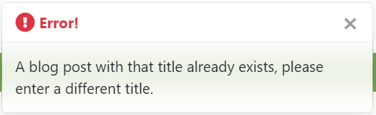

# Testing

## Bugs

### Solved Bugs

- If a superuser attempted to create a new blog post with a title that matched the title of an existing blog post, an IntegrityError would occur. This Unique constraint failure was occuring because the slug for each blog post must be unique. 

    

    **Fix:** To fix this a list of the existing slugs is created in the view.

    ```python
    slugs = list(Post.objects.all().values_list('slug', flat=True))
    ```
    In the POST request before the blog post object is saved to the database, there is a check to determine if the slug is contained in the list of existing slugs. If it is in the list, a message is displayed prompting the user to enter a different title. Otherwise the post is saved successfully to the database.

    ```python
    if post.slug in slugs:
        messages.error(request, 'A blog post with that title \
            already exists, please enter a different title.')  
    else:
        post.save()
        messages.success(request, f'Blog post "{post.title}" \
                        successfully added!')
        return redirect('blog')
    ```

    

- The above error also occured if a superuser was editing a blog post and changed the title to that of an existing blog post title. The same fix was used as above but this introduced a new bug. Now when editing a post, even if the title of the post was not edited, the error message would be displayed. This occured because the list of existing slugs in the database already contained the slug for the post that was being edited. Therefore the check to see if the list contained the slug always returned True, which in turn always displayed the error message. 

    **Fix:** In the edit_post view, remove the slug for the post that is being edited from the list of existing slugs.

    ```python
    slugs.remove(post.slug)
    ```

- If a superuser edited a blog post that was created by a different superuser, the author field would be updated to the superuser who edited the post. This occured because author field for a blog post was being updated in the edit_post view.

    ```python
    post.author = str(request.user)
    ```
    
    **Fix:** Remove the above line of code from the edit_post view. In future development the author field for a blog post can be related to the Django User model.