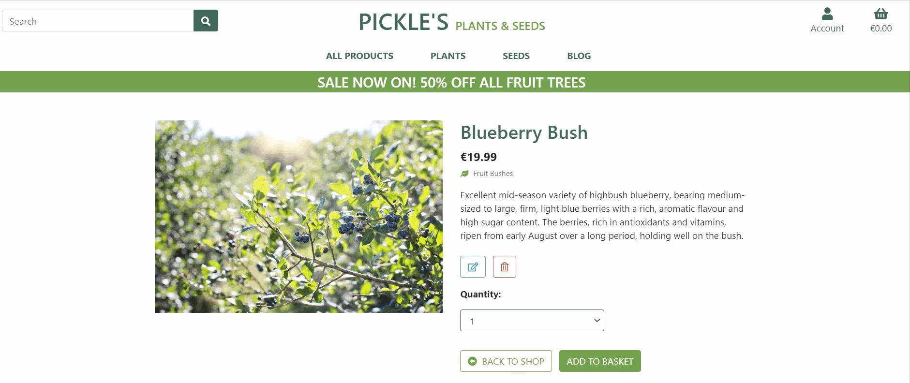
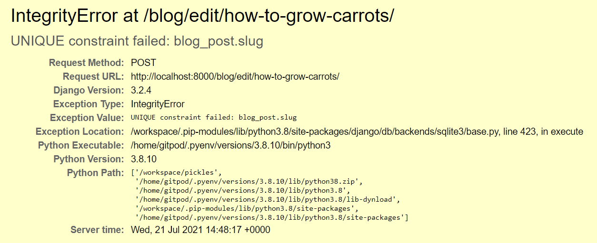

# Testing

## Testing User Stories

- As a **store owner**, I want to be able to:

    1. *Add a product, so that I can add new items to my store.*

        Store owners have access to a Product Admin page which contains a form that allows them to a add a new product to the store. 
        
        


    2. *Edit a product, so thas I can change the details of the product such as its price, description, image and other properties.*

        On the product info page for each product, an edit product button is displayed for store owners. Clicking this button directs the store owner to a form where they can edit the details of the product.

        


    3. *Delete a product, so that I can remove items from my store that are no longer available.*

        On the product info page for each product, a delete product button is displayed for store owners. Clicking this button opens a modal which askes the user if they wish to delete the product. Clicking the modal delete button removes the item from the store.

        


    4. *Add a blog post, so that I can add new content to my blog page to help drive traffic to my store.*

        On the blog page, an Add Blog Post button is displayed for store owners. Clicking the button directs the user to a new page where a form is displayed for adding a new blog post.

        


    5. *Edit a blog post, so thas I can change the details of the blog such as its title, content, image and other properties.*

        In each blog post page, there is a button located below the blog post content, visible only to store owners. Clicking the button directs the user to a form where the blog post details can be edited.

        


    6. *Delete a blog post, so that I can remove blog posts that are outdated or irrelevent.*

        In each blog post page, there is a button located below the blog post content, visible only to store owners. Clicking this button opens a modal which askes the user if they wish to delete the blog post. Clicking the modal delete button removes the blog post.

        


    7. *Delete a blog post comment, so that I can remove a comment that contains offensive content.*

        There is a delete button under every blog post comment that is visible to only store owners. Clicking this button opens a modal which askes the user if they wish to delete the comment. Clicking the modal delete button deletes the comment.

        
    

    8. *Delete a product review, so that I can remove a review that contains offensive content.*

        There is a delete button under every review that is visible to only store owners. Clicking this button opens a modal which askes the user if they wish to delete the review. Clicking the modal delete button deletes the review.

        


    As a **visitor**, I want to be able to:

    1. Easily register for an account so that I can login and view my account.
        
        A register link located in the navbar directs the visitor to a register page where they can input their account details. On completion of the signup form, an email is sent to the user asking them to confirm their email address. Once they connect their email to their account thay can login to the site.

        

    2. View all the available products so I can choose some to purchase.

        In the navbar there is a menu option called 'All Products' which when clicked, redirects the user to a page containing all the products in the shop.

        

    3. Sort the all of the available products based on their price, name or category.

        Shoppers have the option to sort products by their price or category by clicking on the relevent links in the navbar. There is also a sort selector box where a user can sort by products by price, name and category.

        

     4. View a particular category of products so I can find products I am interested in faster.

        In the navbar, users can click on the 'PLANTS' or 'SEEDS' option which opens a submenu giving the user additional options on the type of plants or seeds they wish to view.

    5. Sort a particular category of products based on their price, name or category.

        When a user chooses an option from a submenu for example 'Fruit Trees' the products displayed are filtered to only show fruit trees. By clicking on the 'Sort by...' button, users can sort the fruit trees by price or name.

        

    6. Sort multiple categories of products simultaneously to find the best priced products across broad categories such as plants or seeds.

        Clicking on the 'All Plants' submenu option will display all of the fruit trees, fruit bushes and vegetable plants. Clicking on the 'All Seeds' option will display all of the vegetable seeds and bulbs.
    
    7. View the details of an individual product such as its price, description and reviews.

        By clicking on a products image, or by clicking on the information button, users are redirected to the products information page where they can view more details on the product.

        

    8. Leave a review of a product so I can let other shoppers know what I think of the product.

        On each individual product's information page there is a 'Leave a Review' button which opens a form for a user to leave a review for that particular product.

        

    9. Search for a product by name or description so that I can quickly find a specific product.

        A search bar is located in the navbar which can be used to search products based on their name and description. 

        

    10. Quickly see search results and the number of results.

        The number of products found and the original search term are displayed above the search results. 

        

    11. Quickly add a product to my basket without having to view that product's individual page.

        Clicking on the shopping basket icon will add a product to the shopping basket. A toast will be displayed confirming the successful adding of the product.

        

    12. Easily select the quantity of a product when purchasing it.

        A select element is provided where a shopper can easily select the quantity of a product they wish to purchase.

        

    13. View the products in my shopping basket to be purchased.

        Clicking on the shopping basket icon in the navbar will redirect the user to a shopping baket page. This page displays the contents of the user's shopping basket. When a user adds an item to their shopping basket, a toast is displayed which gives them the option of viewing their basket.

        

    14. Adjust the quantity of individual items in my shopping basket.

        Each product in the shopping basket contains a select element which a user can use to adjust the quantity of the product in the basket. Clicking 'update' wil update the quantity and clicking the red 'x' will delete the product from the basket.

        

    15. Easily view the total value of my purchases at any time.

        The shopping basket icon in the navbar shows the current value of the shopping basket. It is visible on all devices and on every page of the website. 

        

    16. Quickly enter my personal and payment information so that I can check out fast and hassle free.

        Clicking on the checkout button will redirect the user to the checkout page. A form is provided for the user to input their details and make a payment. If the user has saved their delivery details previously, the form will be prepopulated with these details.

    17. View an order confirmation and receive an email confirmation after completing a purchase.

        On completing the checkout process, a toast is displayed which confirms the order has been received, displays the order number and tells the user a confirmation email has been sent. An order summary is also displayed showing all of the order information. 

        

    18. Leave a comment on a blog post so I can contribute to a subject I am interested in.

        Under each blog post there is a form where a user can add a comment relating to the blog post. 

        


    As a **registered user**, I want to be able to:

    1. Easily login or logout of my account.

        A login link located in the navbar directs the user to the login page where the user can login with their usernam or email address. Once logged in the navbar provides a link to logout. Clicking this link directs the user to a logout page where they are asked to confirm they want to sign out.

        

    2. Easily recover my password if I forget it.

        

    3. Have a personalized user profile page so that I can view my order history and delivery information.

        Each registered user has a profile page which contains a list of their previous orders and a form where the user can update their delivery information.
        
        
        
    4. Easily add or update my delivery information.

        A user's delivery information can be easily updated using the form provided on their profile page.

## Bugs

### Solved Bugs

- If a superuser attempted to create a new blog post with a title that matched the title of an existing blog post, an IntegrityError would occur. This Unique constraint failure was occuring because the slug for each blog post must be unique. 

    

    **Fix:** To fix this a list of the existing slugs is created in the view.

    ```python
    slugs = list(Post.objects.all().values_list('slug', flat=True))
    ```
    In the POST request before the blog post object is saved to the database, there is a check to determine if the slug is contained in the list of existing slugs. If it is in the list, a message is displayed prompting the user to enter a different title. Otherwise the post is saved successfully to the database.

    ```python
    if post.slug in slugs:
        messages.error(request, 'A blog post with that title \
            already exists, please enter a different title.')  
    else:
        post.save()
        messages.success(request, f'Blog post "{post.title}" \
                        successfully added!')
        return redirect('blog')
    ```

    

- The above error also occured if a superuser was editing a blog post and changed the title to that of an existing blog post title. The same fix was used as above but this introduced a new bug. Now when editing a post, even if the title of the post was not edited, the error message would be displayed. This occured because the list of existing slugs in the database already contained the slug for the post that was being edited. Therefore the check to see if the list contained the slug always returned True, which in turn always displayed the error message. 

    **Fix:** In the edit_post view, remove the slug for the post that is being edited from the list of existing slugs.

    ```python
    slugs.remove(post.slug)
    ```

- If a superuser edited a blog post that was created by a different superuser, the author field would be updated to the superuser who edited the post. This occured because author field for a blog post was being updated in the edit_post view.

    ```python
    post.author = str(request.user)
    ```
    
    **Fix:** Remove the above line of code from the edit_post view. In future development the author field for a blog post can be related to the Django User model.

- When adding a new blog post, the tags field was not saving to the database. The post model's tags field is a ManyToManyField that points at the Tag model. To save the tags field form data, the save_m2m method can be used. 

    **Fix:** Invoke the save_m2m() method to save the many-to-many form data. Apply it when editing a blog post too.
    
    ```python 
    form.save_m2m()
    ```